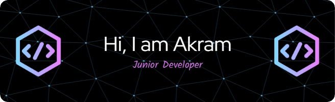

## About Me

Full-stack developer specializing in MERN technologies, transforming ideas into robust, scalable applications. Eager to contribute expertise in creating seamless user experiences. Actively seeking new opportunities to bring innovation to the tech world.

## Tech Stack

-   JavaScript,  HTML, CSS
-   React.js
-   Node.js,    Express.js
-   MongoDB
- 🛠️ RESTful APIs,  Firebase
-   Git, GitHub
-   Tailwind

## Projects

Here are some of the projects I'm currently working on:

1. [Hyper Market live link](https://hyper-market-67575.web.app/) - This is a Online Marketplace project. It provides a user interface for browsing and interacting with job listings in various categories.
2. [Brand Shop live link](https://brand-shop-2ee26.web.app/) - Tech and Electronics E-commerce project. This application is built to provide an engaging and user-friendly shopping experience for tech and electronics enthusiasts.
3. [Event Management live link](https://educational-events-cb705.web.app/) - It is an application that provides event management solution to the customers.

Feel free to explore my repositories for more projects and contributions!

## Connect with Me

- 📧 Email: akramkaikobad@gmail.com
- 💼 LinkedIn: [Md. Akram](https://www.linkedin.com/in/md-akram-kaikobad/)

## GitHub Stats

